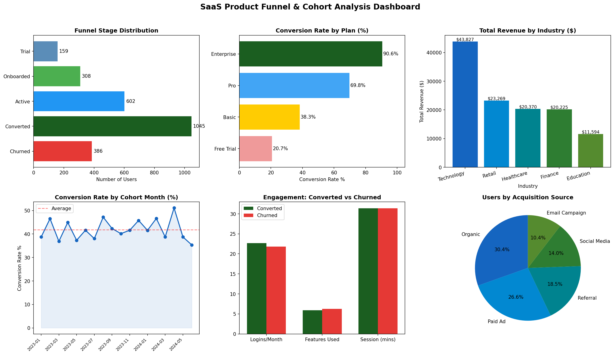
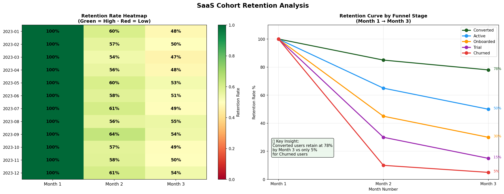

# 📊 SaaS Product Funnel & Cohort Retention Analysis


---

## 📌 Business Problem

A SaaS company with 2,500 users needs to understand why only 20.7% of
Free Trial users convert to paid plans, which funnel stages lose the most
users, and what separates users who convert from those who churn.

**My Role:** Data Analyst brought in to analyse the full user funnel,
identify drop-off points, build cohort retention analysis, and deliver
actionable recommendations to improve conversion rate.

---

## 🔍 Key Findings

| Finding | Detail | Business Impact |
|---|---|---|
| Free Trial conversion is critically low | Only 20.7% convert vs 90.6% Enterprise | Biggest revenue opportunity |
| 34.1% of users never pass onboarding | Trial + Onboarded + Churned combined | Onboarding experience needs fixing |
| Technology industry drives 3x revenue | $43,827 vs $23,269 (Retail, 2nd) | Focus acquisition on Tech sector |
| Converted users retain at 15x the rate | 78% vs 5% by Month 3 | Conversion is the key retention driver |

---

## 📈 Analysis Components

### SQL Analysis (6 Queries)
- Funnel stage drop-off breakdown
- Conversion rate by plan (Free Trial → Enterprise)
- Conversion rate by acquisition source
- Cohort performance by signup month
- Engagement metrics by funnel stage
- Revenue and conversion by industry

### Python Visualizations
- Funnel stage distribution bar chart
- Conversion rate by plan
- Revenue by industry
- Cohort conversion trend line
- Engagement comparison: Converted vs Churned
- Acquisition source breakdown

### Cohort Retention Heatmap
- Month-over-month retention by cohort (12 cohorts)
- Retention curve by funnel stage (Month 1 → Month 3)
- Green/Red colour coding for instant pattern recognition

---

## 📊 Dashboard Preview

### Funnel & Revenue Analysis


### Cohort Retention Heatmap


---

## 💡 Business Recommendations

1. **Fix Free Trial onboarding** — 79.3% of trial users never convert.
   Add guided onboarding flow and trigger email at day 7 for inactive trials.

2. **Focus acquisition on Technology sector** — highest revenue per user.
   Reallocate paid ad budget toward tech-focused channels.

3. **Upgrade path for Basic users** — 38.3% conversion vs 69.8% for Pro.
   Introduce a mid-tier plan between Basic and Pro to reduce price jump.

4. **Month 3 retention intervention** — retention drops sharply after Month 2.
   Trigger re-engagement campaign at day 45 for at-risk active users.

---

## 🗂️ Project Structure

```
saas-funnel-cohort-analysis/
├── Cohort_Funnel_Project.ipynb     # Full analysis notebook
├── saas_users.csv                  # Generated SaaS dataset (2,500 users)
├── saas_funnel_analysis.png        # 6-chart dashboard
├── cohort_retention_heatmap.png    # Cohort heatmap + retention curves
└── README.md
```

---

## 🛠️ Tech Stack

| Layer | Tools |
|---|---|
| Data Generation | Python (numpy, pandas) |
| Storage | SQLite |
| Analysis | SQL (6 queries) · pandas |
| Visualization | matplotlib · seaborn |
| Environment | Google Colab |

---

## 📁 Dataset

**Type:** Synthetic SaaS user dataset (realistic distributions)
**Size:** 2,500 users · 15 columns
**Key columns:** plan · funnel_stage · cohort_month · is_converted ·
is_churned · logins_per_month · features_used · monthly_revenue

---

## 👤 Author

**Dhilipan Shelly M**
MBA in AI & Data Science · Data & Business Analyst
[](https://linkedin.com/in/dhilipan-shelly-94799b231)
[](mailto:dhilipanshelly@gmail.com)
